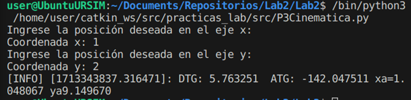
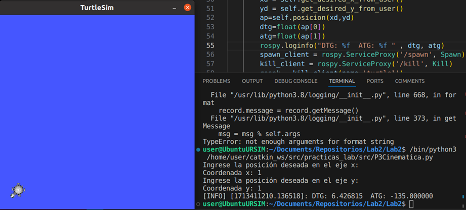
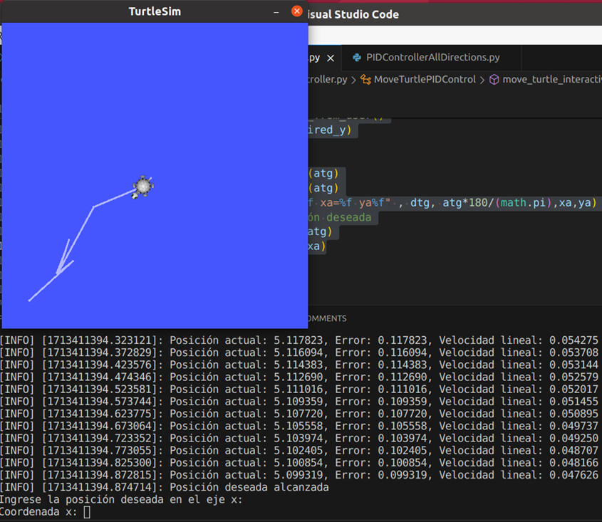

# Lab3: Distancia Euclidiana
165096 Diego de Jesús Gutiérrez Reyes
167464 Aldo Fuentes Cruz

# Introducción
## Distancia Euclidiana
La distancia euclidiana se define como la distancia ordinaria entre dos puntos en un espacio euclidiano, dicho de otro modo es la ruta directa de un punto A a un punto C, cuando la ruta perviamente establecida marca una secuencia del punto A al punto B, para finalizar en el punto C, en la siguiente Figura se observa como la distancia euclidiana es defenida por la variable "d".

Para obtener el valor de la distancai euclidiana se emplea la ecuación de ésta, la cual se basa en el Teorema de Pitágoras, y es válida para los puntos ubicados en un plano euclidiano, la ecuación es la raíz cuadrada de la suma de los cuadrados de los valores de las posiciones del punto B menos los valores de las posiciones del punto A, matemáticamente expresado como:

## Turtlesim
Turtlesim es un robot empleado en el enotorno de ROS basado en el Turtlebot, su uso radica en el aprendizaje del propio ROS, así como la conexión de nodos.

A este robot es posible envíarle, mediante nodos, la información de movimiento en su entorno simulado, de modo que se controla el movimiento en los ejes X y Y, así como la rotación del mismo sobre su propio eje para el cambio de direcciones, la siguiente Figura muestra la ejecución de la simulación en el entorno ROS.

# Metodología
1. Calcular y mostrar en pantalla la DTG y ATG.
2. No mover el robot, hacer spawn del mismo en la posición Goal.
3. Explicar el mapeo necesario para las velocidades.
4. Usar un controlador (libre) para llevar a la tortuga a la posición deseada, hacerlo en bucle infinito.

# Resultados
La primera parte de esta practica consiste en el calculo de la distancia a avanzar y el ángulo a girar con respecto a la posición actual del robot dadas un par de coordenadas x,  y con respecto a un eje de referencia fijo que será el origen del ambiente en donde se mueve el robot. Para alcanzar el destino primero se debe conocer el ángulo a girar y realizar el giro del robot, luego se debe calcular la distancia a alcanzar sobre el eje x del robot y avanzar. Para lograr este cálculo se requiere como entrada una coordenada a alcanzar por el robot (xd,yd).  Una vez con las coordenadas se prosigue a aplicar identidades y ecuaciones trigonométricas para conocer el ángulo a girar, que este dado por $tan^-1(y/x)$ y la distancia a lograr que no es mas que la hipotenusa del triangulo formado, dicha distancia esta dada por el teorema de Pitágoras
d = sqrt(x^2+y^2).  
Para programar estos cálculos usando Python se requieren las siguientes librerías: 
        from math import atan2, radians
        import math
        from math import sqrt
Para conocer la posición actual de la tortuga usamos la función 
        def pose_callback(self, pose):
                # Función que se ejecuta cada vez que llega una actualización de la posición de la tortuga
                self.current_x = pose.x
                self.current_y = pose.y
y para calcular la distancia a lograr (DTG) y el ángulo (ATG) necesitamos conocer la posición actual de la tortuga, ya que las ecuaciones mostradas anteriormente toman el origen del plano condenado como posición del objeto. Los cálculos son ejecutados en la función “posición” la cual devuelve los valores ATG y DTG
              $  def posicion(self,xd,yd):
                        x = self.current_x
                        y = self.current_y 
                        dtg = sqrt((xd-x)**2+(yd-y)**2)
                        atg = math.atan2((yd-y),(xd-x))*180/(math.pi)
                        info = [dtg, atg]
                        return info $

para mostrar los cálculos en la consola usamos la línea: 
        rospy.loginfo("DTG: %f  ATG: %f , dtg, atg)

Ahora para comprobar que los cálculos sean correctos se hará aparecer la tortuga con la distancia y ángulos (DTG y ATG) calculados. Para crear una tortuga en el turtlesim se requiere usar el servicio Spawn. En ROS, un servicio es un mecanismo que permite la comunicación entre nodos de forma asíncrona. Los servicios proporcionan una manera para que los nodos soliciten a otros nodos que realicen ciertas tareas y, opcionalmente, proporcionen una respuesta.
El servicio Spawn se utiliza para crear nuevas instancias de tortugas en el entorno de simulación. Permite especificar la posición inicial y la orientación de la nueva tortuga en el espacio bidimensional.

Definición del servicio spawn en ROS turtlesim:
Nombre del servicio: /spawn
Tipo de mensaje de solicitud: turtlesim.srv.Spawn
Tipo de mensaje de respuesta: turtlesim.srv.SpawnResponse
La solicitud (turtlesim.srv.Spawn) incluye los siguientes campos:
float32 x: La posición en el eje x donde se desea spawnear la tortuga.
float32 y: La posición en el eje y donde se desea spawnear la tortuga.
float32 theta: La orientación inicial (ángulo en radianes) de la tortuga.

Para incluir este servicio en un script de Python tendremos que usar las librerías de ros. 
Dentro del código necesitaremos crear un nodo para lograr la comunicación con la tortuga: 
        rospy.init_node('controlAtg')
                
                # Suscribirse al topic de la posición de la tortuga
                self.pose_subscriber = rospy.Subscriber('/turtle1/pose', Pose, self.pose_callback)
                
                # Publicar en el topic de comandos de movimiento de la tortuga
                self.velocity_publisher = rospy.Publisher('/turtle1/cmd_vel', Twist, queue_size=10)

Ahora También debemos incluir las líneas para esperar a que el servicio esté disponible en la red ROS
            rospy.wait_for_service('/spawn')
        	rospy.wait_for_service('/kill')

el servicio kill también  es usado para desaparecer la tortuga original y no llenar el workspace de tortugas 
la función principal del script de Python es: 
        def move_turtle_interactively(self):
                xd = self.get_desired_x_from_user()
                yd = self.get_desired_y_from_user()
                ap=self.posicion(xd,yd)
                dtg=float(ap[0])
                atg=float(ap[1]) 
                rospy.loginfo("DTG: %f  ATG: %f xa=%f ya%f" , dtg, atg,xa,ya)
                spawn_client = rospy.ServiceProxy('/spawn', Spawn)
                kill_client = rospy.ServiceProxy('/kill', Kill)
                respk = kill_client(name='turtle1')
                resp = spawn_client(x=xd, y=yd, theta=atg*math.pi/180,name='turtle1')

en donde calculas DTG y ATG y usamos los valores para aparecer y desaparecer las tortugas mediante los servicios spawn y kill.
La siguiente imagen muestra el spawn de la tortuga en la coordenada 1,1 y los cálculos ATG y DTG

Para la ultima parte de la práctica se requiere utilizar un controlador PID para controlar la posición y velocidad de la tortuga, y que siga el modelo dinámico de un robot de tracción diferencial. 
El modelo dinámico de un robot de tracción diferencial solamente puede rotar sobre un punto correspondiente a su centro de masa y solamente puede avanzar sobre un eje, el cual se asume como el eje x. Este modelo utiliza los cálculos presentados previamente ATG y DTG. 
Debemos iniciar el Nodo de ros y usar los tópicos CMD_vel  y pose para enviar la velocidad y obtener la posición.  

        def __init__(self):
                rospy.init_node('control_tortuga_x')
                
                # Suscribirse al topic de la posición de la tortuga
                self.pose_subscriber = rospy.Subscriber('/turtle1/pose', Pose, self.pose_callback)
                
                # Publicar en el topic de comandos de movimiento de la tortuga
                self.velocity_publisher = rospy.Publisher('/turtle1/cmd_vel', Twist, queue_size=10)
                
                # Tasa de publicación de mensajes (10 Hz)
                self.rate = rospy.Rate(20)
                
                self.current_x = 0
                self.current_y = 0
                self.current_t = 0
                self.last_error_x = 0
                self.last_error_y = 0
                self.last_error_t = 0
                self.error_accumulation = 0
                self.q1anterior = 0

Ahora para controlar la tortuga se requieren dos funciones que incluyen los controladores PID para velocidad en x y velocidad angular en z respectivamente. 

        def move_turtle_to_desired_x(self, desired_x):
                # Constantes de proporcionalidad, integral y derivativa del controlador (ajustables)
                Kp = 1
                Ki = 0.01
                Kd = 0.1
                x = self.current_x
                q1 = self.current_t
                while not rospy.is_shutdown():
                    # Calcular el error de posición
                    #Ajuste del valor actual de x con referencia a la tortuga 
                        #dx*cos(q1) - conj(y)*sin(q1) - cos(q1)*conj(x) + dy*sin(q1)
                    #currentx = self.current_x*math.cos(q1) - y*math.sin(q1) - math.cos(q1)*x + self.current_y*math.sin(q1)
                    error_x = abs(desired_x - self.current_x)
                    
                    # Sumar el error a la acumulación de errores
                    self.error_accumulation += error_x
                    
                    # Calcular la velocidad lineal del movimiento
                    vel_x = Kp * error_x + Ki * self.error_accumulation + Kd * (error_x - self.last_error_x)
                    
                    # Guardar el error actual para usarlo en la próxima iteración
                    self.last_error_x = error_x
                    
                    # Crear un mensaje de Twist para enviar el comando de movimiento
                    twist_msg = Twist()
                    twist_msg.linear.x = vel_x
                    
                    # Publicar el mensaje
                    self.velocity_publisher.publish(twist_msg)
                    
                    # Imprimir la posición actual, el error y la variable vel_x en la terminal
                    rospy.loginfo("Posición actual: %f, Error: %f, Velocidad lineal: %f", self.current_x, error_x, vel_x)
                    
                    # Verificar si se alcanza la posición deseada
                    if abs(error_x) < 0.1:
                        rospy.loginfo("Posición deseada alcanzada")
                        break
                    
                    # Esperar hasta la siguiente iteración
                    self.rate.sleep()

    

        def move_turtle_to_desired_t(self, desired_t):
            # Constantes de proporcionalidad, integral y derivativa del controlador (ajustables)
            Kp = 1
            Ki = 0.00
            Kd = 0.0
            self.error_accumulation = 0 
            desiredt=desired_t
            while not rospy.is_shutdown():
                
                # Calcular el error de posición
                error_t = desiredt - self.current_t
                
                # Sumar el error a la acumulación de errores
                self.error_accumulation += error_t
                
                # Calcular la velocidad lineal del movimiento
                vel_t = Kp * error_t + Ki * self.error_accumulation + Kd * (error_t - self.last_error_t)
                
                # Guardar el error actual para usarlo en la próxima iteración
                self.last_error_t = error_t
                
                # Crear un mensaje de Twist para enviar el comando de movimiento
                twist_msg = Twist()
                twist_msg.angular.z = vel_t
                
                # Publicar el mensaje
                self.velocity_publisher.publish(twist_msg)
                
                # Imprimir la posición actual, el error y la variable vel_x en la terminal
                rospy.loginfo("Posición actual: %f, Error: %f, Velocidad angular: %f", self.current_t, error_t, vel_t)
                
                # Verificar si se alcanza la posición deseada
                if abs(error_t) < 0.05:
                    rospy.loginfo("Posición deseada alcanzada")
                
                    break
                
                # Esperar hasta la siguiente iteración
                self.rate.sleep()
                self.q1anterior = self.current_t

por último, la función principal que se usa para llamar las funciones previamente declaradas 
        def move_turtle_interactively(self):
                while not rospy.is_shutdown():
                    # Obtener la posición deseada del usuario
                    desired_x = self.get_desired_x_from_user()
                    desired_y = self.get_desired_y_from_user()
                    ap=self.posicion(desired_x,desired_y)
                    dtg=float(ap[0])
                    atg=float(ap[1])
                    xa=self.current_x+dtg*math.cos(atg)
                    ya=self.current_y+dtg*math.sin(atg)
                    rospy.loginfo("DTG: %f  ATG: %f xa=%f ya%f" , dtg, atg*180/(math.pi),xa,ya)
                    # Mover la tortuga a la posición deseada
                    self.move_turtle_to_desired_t(atg)
                    self.move_turtle_to_desired_x(xa)

            

  Ahora como se puede ver en la imagen la tortuga se comporta como un robot de tracción diferencial avanzando solamente sobre un eje y rotando sobre su centro de gravedad o en este caso su centro geométrico, el programa pide por coordenadas deseadas X, y Y el robot gira el valor ATG calculado alineando su eje x con el punto deseado y avanzando la distancia DTG. 
El mapeo de posición a velocidad es realizado por el controlador, calculando el error actual. 
